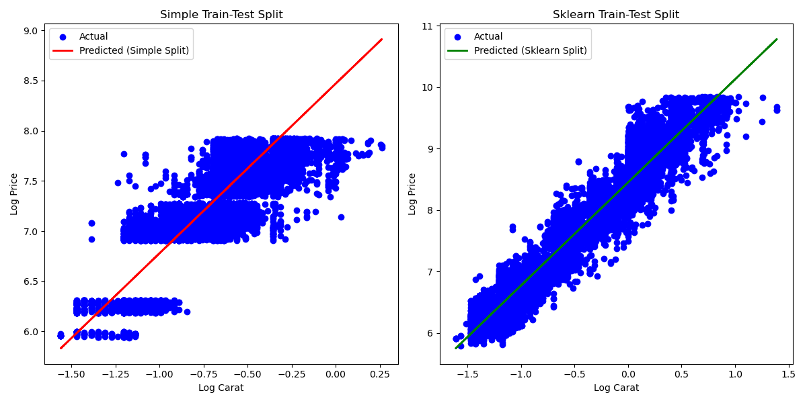

# hw-diamonds

## Assignment

Use the [diamonds dataset](https://ggplot2.tidyverse.org/reference/diamonds.html) to answer the questions below.
You can get the data directly from the "data-raw" directory in the [ggplot2 github repo](https://github.com/tidyverse/ggplot2/).

## Question 1

Visualize the relationship between "price" and "carat" and comment on the type of model that 
might be appropriate for modeling their relationship.

## Solution

### Run below command to get the o/p

```
make quest1
```

Below is the op you get:


The relationship between price and carat appears to be non-linear and possibly exponential. This suggests that a polynomial regression or a model involving logarithmic transformation of carat might be appropriate.

## Question 2

Investigate logarithmic transformations to see if you can find a more appropriate relationship
between "price" and "carat" for univariate linear regression.
Use data visualization to help justify your choice of model.
Use explained variance score as a metric for model performance, and report training scores based on the entire dataset.

## Solution

### Run below command to get the o/p

```
make quest2
```
Below is the op you get:


The scatter plot of log-transformed variables ("log_carat" vs. "log_price") shows a clearer linear relationship compared to the original variables

The explained variance score provides an assessment of how well the linear regression model fits the data. In this case, using the logarithmic transformations of "carat" and "price" improved the linearity of the relationship, making the model more appropriate for linear regression. The reported explained variance score gives us insight into the performance of this model in capturing the variation in "log_price" explained by "log_carat".

This approach demonstrates how logarithmic transformations can enhance the suitability of linear regression models for variables that exhibit non-linear relationships, such as those found in the diamonds dataset.

## Question 3

Use the `simple_train_test_split` function below and `sklearn.model_selection.train_test_split` 
to evaluate the explained variance of the univariate model using the testing dataset.
Use explained variance as a metric for model performance.
Describe the results and create a visualization that helps explain the differences between the two approaches.
```
def simple_train_test_split(X, y, test_size=.3):
    n_training_samples = int((1.0 - test_size) * X.shape[0])

    X_train = X[:n_training_samples,:]
    y_train = y[:n_training_samples]

    X_test = X[n_training_samples:,:]
    y_test = y[n_training_samples:]

    return X_train, X_test, y_train, y_test
```

## Solution

Run below command to get the o/p:

```
make quest3
```

Below is the o/p:




## Question 4

Use one-hot encoding to find the best 2-input model by adding either "cut", "color" or "clarity" as a second predictor along with "log(carat)" to model "log(price)". Which 2-input model has the best performance? Report the training score
with explained variance metric, using the entire dataset for both training and evaluation. Compare to the corresponding univariate model in question 2. What's the ".shape" of the feature matrix for the "best" model?

## Solution

Run below command to get the o/p:

```
make quest4
```

Below is the o/p:


## Question 5

Repeat the analysis of Question 4, this time using 5-fold cross validation.
Report both train and test scores (average +/- standard deviation).
Compare results here with those of Question 4.
Discuss results and explain any significant differences with Question 4.

## Solution

Run below command to get the o/p:

```
make quest5
```

Below is the o/p:

figs/q5.png
