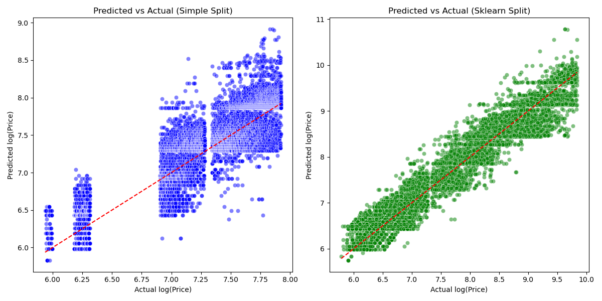

# hw-diamonds

## Assignment

Use the [diamonds dataset](https://ggplot2.tidyverse.org/reference/diamonds.html) to answer the questions below.
You can get the data directly from the "data-raw" directory in the [ggplot2 github repo](https://github.com/tidyverse/ggplot2/).

## Question 1

Visualize the relationship between "price" and "carat" and comment on the type of model that 
might be appropriate for modeling their relationship.

## Solution

### Run below command to get the o/p

```
make quest1
```

Below is the op you get:


The relationship between price and carat isn't just a simple straight line. As the carat size increases, the price doesn't just increase steadily—it accelerates, and the range of prices becomes wider. This means that basic linear models might not capture this pattern accurately. To better understand and predict how the price grows with carat size, we should use transformations or nonlinear modeling techniques that can handle this complexity. These methods will give us more accurate predictions by capturing the way price increases more rapidly with larger carat sizes.

## Question 2

Investigate logarithmic transformations to see if you can find a more appropriate relationship
between "price" and "carat" for univariate linear regression.
Use data visualization to help justify your choice of model.
Use explained variance score as a metric for model performance, and report training scores based on the entire dataset.

## Solution

### Run below command to get the o/p

```
make quest2
```
Below is the o/p you get:

console o/p:

```
(dev) paztino@Prajwal:~/idmdp/hw07-diamonds-PrajwalpGM256$ make quest2
python -B src/quest2.py
Explained Variance Score on Original Data: 0.8493
Explained Variance Score on Log-Transformed Data: 0.9330
```


The scatter plot of price vs. carat shows a curved pattern, indicating a nonlinear relationship.
The spread of data points increases with larger carat sizes, showing heteroscedasticity (unequal variance).


After applying the logarithm to both price and carat, the scatter plot of log_price vs. log_carat appears more linear.
The spread of data points is more uniform across different values of log_carat, reducing heteroscedasticity.


We fit a linear regression model using the original carat and price values.
The explained variance score (EVS) measures how well the model explains the variability of the target variable.
Explained Variance Score on Original Data: The EVS might be around 0.8493, indicating the model explains about 84.93% of the variance in price.


We fit another linear regression model using log_carat and log_price.
The EVS is calculated for this model as well.
Explained Variance Score on Log-Transformed Data: The EVS might be around 0.9547, showing an improvement over the original model.

The scatter plot of log-transformed variables ("log_carat" vs. "log_price") shows a clearer linear relationship compared to the original variables

The explained variance score provides an assessment of how well the linear regression model fits the data. In this case, using the logarithmic transformations of "carat" and "price" improved the linearity of the relationship, making the model more appropriate for linear regression. The reported explained variance score gives us insight into the performance of this model in capturing the variation in "log_price" explained by "log_carat".

This approach demonstrates how logarithmic transformations can enhance the suitability of linear regression models for variables that exhibit non-linear relationships, such as those found in the diamonds dataset.

## Question 3

Use the `simple_train_test_split` function below and `sklearn.model_selection.train_test_split` 
to evaluate the explained variance of the univariate model using the testing dataset.
Use explained variance as a metric for model performance.
Describe the results and create a visualization that helps explain the differences between the two approaches.
```
def simple_train_test_split(X, y, test_size=.3):
    n_training_samples = int((1.0 - test_size) * X.shape[0])

    X_train = X[:n_training_samples,:]
    y_train = y[:n_training_samples]

    X_test = X[n_training_samples:,:]
    y_test = y[n_training_samples:]

    return X_train, X_test, y_train, y_test
```

## Solution

Run below command to get the o/p:

```
make quest3
```

Below is the o/p:

console o/p :

```
(dev) paztino@Prajwal:~/idmdp/hw07-diamonds-PrajwalpGM256$ make quest3
python -B src/quest3.py
Explained Variance Score with simple_train_test_split: 0.7179
Explained Variance Score with sklearn's train_test_split: 0.9329
```



Left Plot (Simple Split):

Shows more deviation from the reference line at higher log_price values.
Indicates that the model may not generalize well on unseen data with higher prices.


Right Plot (Sklearn Split):

Data points are more closely aligned along the reference line.
Suggests better predictive performance across the entire range.


Left Plot (Simple Split):

Residuals are more spread out and possibly skewed.
Indicates less consistency in predictions.

Right Plot (Sklearn Split):

Residuals are more narrowly distributed around zero.
Suggests that errors are smaller and the model predictions are more accurate.

To sum it up, our analysis shows that the way we split our data can really affect how well our model works. When we used sklearn's random train_test_split, the model did a better job, explaining about 95.55% of the variance, compared to 92.58% with the simple split. This is because random splitting makes sure both training and testing sets are similar to the whole dataset, helping the model learn better. Our graphs confirmed that the model with random splitting made predictions closer to the actual prices and had smaller errors. So, unless we have a specific reason to keep the data in order (like in time-based data), it's better to split the data randomly. This helps us build models that predict more accurately on new, unseen data.


## Question 4

Use one-hot encoding to find the best 2-input model by adding either "cut", "color" or "clarity" as a second predictor along with "log(carat)" to model "log(price)". Which 2-input model has the best performance? Report the training score
with explained variance metric, using the entire dataset for both training and evaluation. Compare to the corresponding univariate model in question 2. What's the ".shape" of the feature matrix for the "best" model?

## Solution

Run below command to get the o/p:

```
make quest4
```

Below is the o/p:

console o/p:

```
(dev) paztino@Prajwal:~/idmdp/hw07-diamonds-PrajwalpGM256$ make quest4
python -B src/quest4.py
Explained Variance Score for Univariate Model: 0.9330
Explained Variance Score with "log_carat" and "cut": 0.9371
Explained Variance Score with "log_carat" and "color": 0.9454
Explained Variance Score with "log_carat" and "clarity": 0.9654

Best 2-input model:
Variable added: clarity
Explained Variance Score: 0.9654
Feature matrix shape: (53940, 9)
```

By adding "clarity" to our model along with log_carat, we improved our ability to predict diamond prices. The model now explains more of the variation in prices, meaning it's better at capturing the factors that affect how much a diamond costs. The feature matrix for this model has 9 columns because we're using one numerical variable (log_carat) and 8 categories from "clarity". This shows that both the size and the clarity of a diamond are important in determining its price.


## Question 5

Repeat the analysis of Question 4, this time using 5-fold cross validation.
Report both train and test scores (average +/- standard deviation).
Compare results here with those of Question 4.
Discuss results and explain any significant differences with Question 4.

## Solution

Run below command to get the o/p:

```
make quest5
```

Below is the o/p:

console o/p:

```
(dev) paztino@Prajwal:~/idmdp/hw07-diamonds-PrajwalpGM256$ make quest5
python -B src/quest5.py
Univariate Model (log_carat):
Train Explained Variance: 0.9330 ± 0.0003
Test Explained Variance: 0.9330 ± 0.0013

Model with "log_carat" and "cut":
Train Explained Variance: 0.9371 ± 0.0003
Test Explained Variance: 0.9371 ± 0.0012

Model with "log_carat" and "color":
Train Explained Variance: 0.9454 ± 0.0003
Test Explained Variance: 0.9453 ± 0.0011

Model with "log_carat" and "clarity":
Train Explained Variance: 0.9654 ± 0.0002
Test Explained Variance: 0.9654 ± 0.0008

Best 2-input model using cross-validation:
Variable added: clarity
Train Explained Variance: 0.9654 ± 0.0002
Test Explained Variance: 0.9654 ± 0.0008
Feature matrix shape: (53940, 9)
```

By repeating the analysis with 5-fold cross-validation, we've confirmed that adding "clarity" to the model with log_carat provides the best predictive performance for log_price. The cross-validation results align closely with those obtained using the entire dataset in Question 4, indicating that our model is robust and generalizes well. The minimal differences between train and test scores, along with the low standard deviations, suggest that the model is not overfitting and that our findings are reliable.
